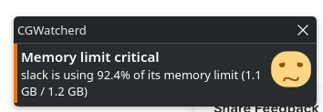
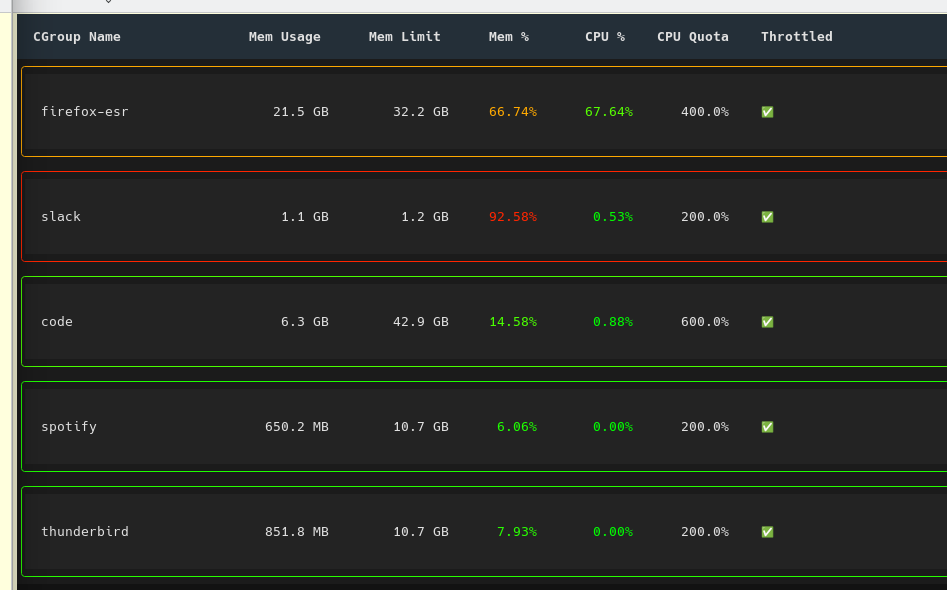

# Tame the desktop

Put all browsers in a pen!

Stop one application from using all memory and slowing down the entire computer/desktop and possibly killing random processes. 
Uses Linux CGroups. ( https://en.wikipedia.org/wiki/Cgroups )

## set cgroup limits

```shell
cp -r examples/* ~/.config/systemd/user/
systemctl --user daemon-reload
```
Adjust the override files or make your own.

# Daemon
## Notification Popup

Gives a warning when apps are using too much memory.



## Install daemon

If manually installing

Edit cgwatcherd.service for right path and copy to ~/.config/systemd/user/cgwatcherd.service
```shell
systemctl --user daemon-reload
```

Enable it
```shell
systemctl --user enable cgwatcherd.service
systemctl --user start cgwatcherd.service
```

## Config

~/.config/cgwatch/cgwatcherd.ini

## see status
```shell
systemctl --user status cgwatcherd
journalctl --user -u cgwatcherd -f
```
# CLI
## CLI Interface

## Run cli

```shell
cgwatcher
```
# Build
```shell
debuild -us -uc -b

# test

```shell
systemd-cgls
systemctl --user set-property --runtime app-slack@f22b6db44f2a4ade8b990458fac649e6.service MemoryMax=1100M
```
