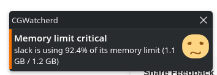
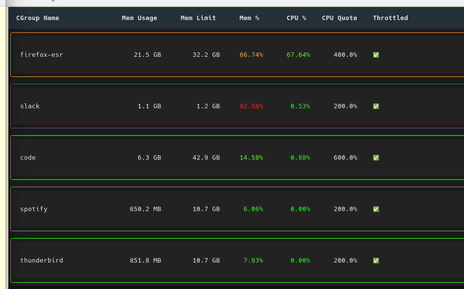

# Tame the desktop

Put all browsers in a pen!

Stop one application from using all memory and slowing down the entire computer/desktop and possibly killing random processes.
Uses Linux CGroups. ( https://en.wikipedia.org/wiki/Cgroups )

## Compatibility / Requirements

This project only works when applications are launched as user systemd
services/scopes (so they can be discovered and controlled with
`systemctl --user`).

| Environment | Support Level | Note |
|---|---|---|
| KDE Plasma | Native | Works out of the box. Apps are launched as individual units in modern Plasma systemd startup. |
| GNOME | Partial | Works for Flatpaks or apps launched via `systemd-run --user`. Many standard app launches are not tracked as discrete units. |
| Others (XFCE, i3, etc.) | Manual | Usually requires launching apps via `systemd-run --user` for cgwatch to see them as separate units/scopes. |

The TUI also needs a recent `textual` version. It works with Debian 13's
package, but not with the older Debian 12 package.

# Daemon
## Notification Popup

Gives a warning when apps are using too much memory.



## Install daemon

If manually installing

Edit cgwatcherd.service for right path and copy to ~/.config/systemd/user/cgwatcherd.service
```shell
systemctl --user daemon-reload
```

Enable it
```shell
systemctl --user enable cgwatcherd.service
systemctl --user start cgwatcherd.service
```

## Config

~/.config/cgwatch/cgwatcherd.ini

This file is auto-created with defaults on first run. Example:

```ini
[Thresholds]
warning_percent = 80
critical_percent = 90
reset_hysteresis = 5

[Timing]
check_interval_sec = 2
process_list_multiplier = 5
notification_timeout_ms = 15000

[Look]
myname = CGWatcherd
icon = face-worried-symbolic.symbolic.png
```

`warning_percent`: send a normal warning notification when a limited app reaches this percentage of its `MemoryMax`.

`critical_percent`: send a critical notification when a limited app reaches this percentage of its `MemoryMax`.

`reset_hysteresis`: suppress repeat notifications until usage rises by this many additional percentage points; notification state is also reset once usage drops below `warning_percent - reset_hysteresis`.

`check_interval_sec`: how often the daemon re-checks memory usage for already tracked limited apps.

`process_list_multiplier`: how many check intervals to wait before rescanning the cgroup tree for the current list of limited apps. The effective rescan period is `check_interval_sec * process_list_multiplier`.

`notification_timeout_ms`: how long the popup notification stays visible, in milliseconds.

`myname`: application name shown in the desktop notification.

`icon`: icon name or icon path passed to `notify-send` for the notification.


## see status
```shell
systemctl --user status cgwatcherd
journalctl --user -u cgwatcherd -f
```

# CLI
## CLI Interface


## Run cli

```shell
cgwatcher
```

## Setting limits

Use the interactive TUI to add and manage memory/CPU limits for desktop services.

| Key | Action |
|-----|--------|
| `↑` / `↓` | Navigate between services (highlight fades after 3 s) |
| `enter` | Edit limits for the focused service |
| `+` / `-` | Increase or decrease MemoryMax by 10% |
| `a` | Add a limit to a new service |
| `delete` | Remove the cgwatch limit from the focused service |
| `n` | Toggle between service description and short name |
| `q` | Quit |

Limits are stored as drop-in files at
`~/.config/systemd/user/<service>.d/zz-cgwatch.conf` and take effect
immediately on the running instance via `systemctl --user set-property`.
The `zz-` prefix ensures they override any other drop-ins in the same
directory without touching those files.

The TUI config file is `~/.config/cgwatch/cgwatch.ini` and is created on first
run if it does not already exist. Optional settings:

```ini
[cgwatcher]
show_descriptions = false
```

`show_descriptions = false` starts the list with short unit names. If you
toggle descriptions with `n`, cgwatch saves the current setting on exit and
uses it as the next startup default.

# Plasma widget

A small KDE Plasma 6 panel widget (`plasmoid/`) — a native third client
alongside the TUI and the notification daemon. The panel shows a compact
gauge (calm/warning/critical, throttle badge); its popup lists the same
limited cgroups as the TUI with live CPU%/throttle deltas, and offers the
same actions: edit a limit inline, unlimit a service, or add a limit to a
running-but-unlimited service.


It talks to a small stateless helper, `cgwatch-cli` (`cgwatch/jsonapi.py`),
run on a timer — the widget itself never touches systemd/cgroups directly.

## Install

```shell
./plasmoid/install.sh          # copy install
./plasmoid/install.sh --link   # dev mode: symlink the repo in as the package
./plasmoid/install.sh --uninstall
```

Then add it from panel right-click -> *Add Widgets…* -> **CGWatch**.
Plasma picks up a brand-new widget live, but its QML component cache is
process-wide, so after editing the widget's code (`--link` dev mode) or
updating an already-installed copy, restart Plasma to load it:

```shell
systemctl --user restart plasma-plasmashell.service
```

## Settings

Right-click the widget -> *Configure CGWatch…*.

`cgwatch-cli` must be resolvable at the point plasmashell invokes it, which
**may not include `~/.local/bin`** even if your login shell's `PATH` does —
if the widget reports "cgwatch-cli not found", set **Helper command** to an
absolute path (e.g. `~/.local/bin/cgwatch-cli` or wherever `pip`/`setup.py`
installed the entry point) in the General settings page. Leave it at the
`cgwatch-cli` default otherwise.

Poll interval, request timeout, and the warning/critical memory thresholds
are also configurable there; the Display page toggles descriptions vs. unit
names in the popup and the panel's throttle badge.

## Mock mode (no live systemd session needed)

Point **Helper command** at the bundled mock script and drive it with a
scenario file:

```shell
# Helper command (widget settings): /path/to/cgwatch/plasmoid/tools/mock-cgwatch-cli.sh
echo critical > ~/.cache/cgwatch/scenario
```

Scenarios: `calm`, `warning`, `critical`, `throttled`, `many`, `fail`
(simulated crash), `missing` (simulated missing helper), `badjson`,
`applyfail`/`applywarn` (`apply` action outcomes — `unlimit` always
succeeds in mock mode). Unset/unknown falls back to `calm`.

# Build
```shell
debuild -us -uc -b
```
